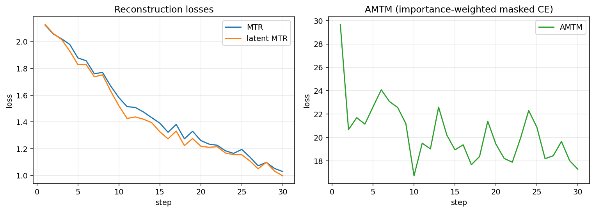
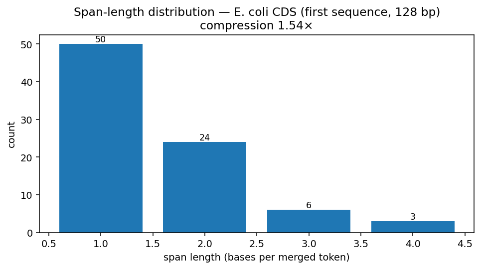
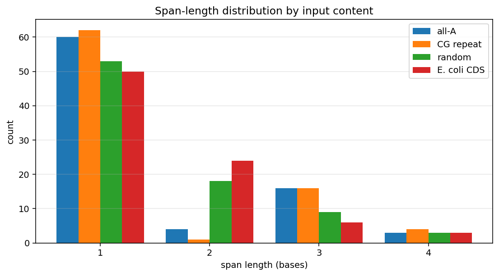

# MergeDNA

This repo is a compact PyTorch prototype of **MergeDNA: Context-aware Genome Modeling with Dynamic Tokenization through Token Merging**. It is meant for a take-home implementation: faithful enough to show the model structure and training objectives, small enough to run tests locally and a toy training loop on CPU or a Colab GPU.

It is not a reproduction of the full paper run. The paper trains a roughly 380M parameter model with 4k-token contexts for 100k steps on 8 A100-80G GPUs. This implementation keeps the same moving parts at a much smaller scale.

## What Is Implemented

- Base-level DNA input over `A/C/G/T/N`, plus padding and mask tokens.
- A local encoder with local-window attention and source-tracked token merging.
- ToMe-inspired local and global merge utilities.
- A latent encoder and decoder over compressed local tokens.
- A local decoder that unmerges latent/local representations back to base resolution.
- Training helpers for MTR, latent MTR, and AMTM.
- Synthetic DNA data, toy training, tokenization inspection, and unit tests.

## Install

With a standard venv:

```bash
python -m venv .venv
source .venv/bin/activate
pip install -e ".[dev,notebook]"
```

Or with `uv` (no venv setup required):

```bash
uv run --with pytest --with torch python -m pytest
uv run python scripts/train_toy.py --steps 50
```

On Colab, install the package from the notebook after cloning the repo.

## Run Tests

```bash
pytest
# or
uv run --with pytest --with torch python -m pytest
```

## Toy Training

```bash
python scripts/train_toy.py --steps 50 --device cpu
```

For a GPU run:

```bash
python scripts/train_toy.py --steps 200 --device cuda
```

To train on your own DNA file (FASTA or plain text):

```bash
python scripts/train_toy.py --fasta path/to/sequences.fa --steps 100
```

The synthetic dataset mixes random DNA with repeats and short motifs. It is only a smoke test that the architecture trains and gradients flow.

Useful flags for longer runs:

- `--print-every 50` to throttle log output when training for many steps.
- `--num-workers 2` to overlap FASTA decoding with the training step.
- `--checkpoint path.pt` saves the model, config, and full per-step loss history. The `results.ipynb` notebook reads the history from this file.

## Inspect Tokenization

```bash
python scripts/inspect_tokenization.py
```

This prints simple token-span statistics from the local merge stack. Repetitive regions should usually produce longer merged spans than noisier regions, though this prototype is intentionally small and not pretrained at paper scale.

## Results

The `notebooks/results.ipynb` notebook loads a checkpoint and produces the figures below from real model output. Re-run it with `--checkpoint checkpoints/your_run.pt` to refresh them after a longer training run.

**Training losses.** All three objectives decrease together; AMTM starts higher because it is a summed cross-entropy over masked bases.



**Per-sequence span distribution.** One merged token covers 1–4 bases. A fixed `k`-mer or BPE tokenizer would put all mass on a single bar; MergeDNA spreads it across span lengths in a content-dependent way.



**Span distribution by input content.** Same model applied to several inputs of equal length. The total token count is identical (the merge budget is fixed by `merge_ratio`); the shape of the distribution differs by content.



The starter figures here come from a short prototype run. Differences between repetitive, random, and real DNA are visible but modest — pair selection is non-differentiable, so the merge-key projection only gets indirect signal, and convincing content-aware behaviour needs much more training on more diverse data than a single bacterial genome.

## How This Maps To The Paper

MergeDNA learns a dynamic tokenizer by repeatedly applying local attention and token merging. The resulting local tokens keep a source map back to original bases. A latent Transformer then models the compressed sequence globally, with decoders reconstructing base-level outputs.

This repo mirrors that flow:

1. `LocalEncoder`: embeds bases, applies local attention, and merges similar nearby tokens.
2. `LatentEncoder`: applies full self-attention to the compressed local tokens.
3. `LatentDecoder`: reconstructs local-token representations.
4. `LocalDecoder`: unmerges token representations to base resolution and predicts bases.
5. `losses.py`: exposes MTR, latent MTR, and AMTM-style losses.

The merge code favors clarity over maximum throughput. Source groups are tracked as integer base-position lists, then expanded when needed for unmerge and masking.

## Faithfulness Notes

What this implementation matches:

- Local Encoder with stacked local-window attention and source-tracked merging.
- Latent Encoder runs at length L with one ToMe-style merge inside it, producing `(Z'_K, S')`.
- The latent decoder runs on the unmerged-to-L tensor, as in the paper's Sec. 3.4.
- Detached local encoder gradients on the latent MTR path (`L_MTR(theta \ {phi})`).
- AMTM importance sampling with probability proportional to `1 / g_i^2` and AMTM loss normalized by `K`, the number of selected latent tokens (Eq. 7).
- Per-step compression ratio jitter in the Local Encoder during training.
- `lambda = 0.25` weighting on the latent MTR term.

What is intentionally simpler:

- Pair selection is a hard top-k by cosine similarity rather than the full DTEM grouping-embedding formulation.
- One global merge inside the latent encoder rather than ToMe-style merging at every latent layer.
- Plain learned positional embedding rather than LLaMA-style rotary embeddings.
- Includes `N` in the base vocabulary to handle real DNA files; the paper uses `{A,C,G,T}` only.

## Out Of Scope

- No 380M parameter training run.
- No 100k-step multi-species pretraining.
- No full Genomic Benchmark, NT, or GUE reproduction.
- No highly optimized sparse/ragged CUDA kernels.

## Scaling Up

The defaults are deliberately small. For Colab or a larger GPU, try increasing `d_model`, `seq_len`, layer counts, batch size, and training steps in `MergeDNAConfig` and `scripts/train_toy.py`. The first bottleneck will be Python-level source tracking and repeated variable-length batching, not the Transformer blocks.
